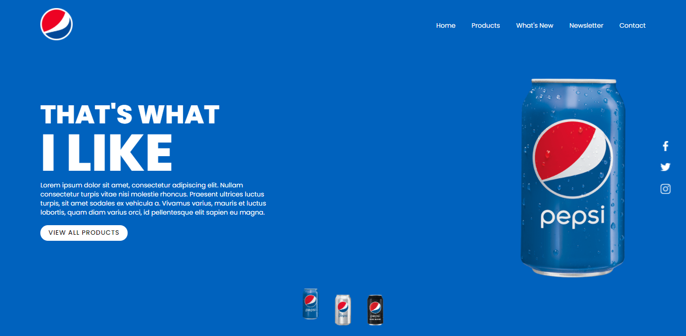
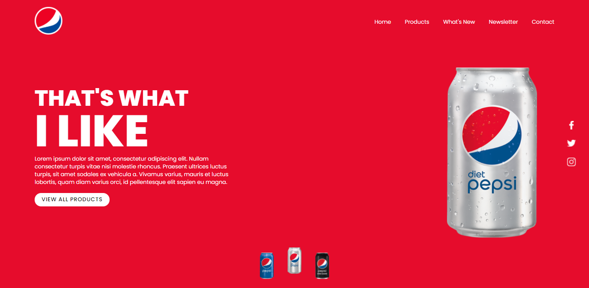
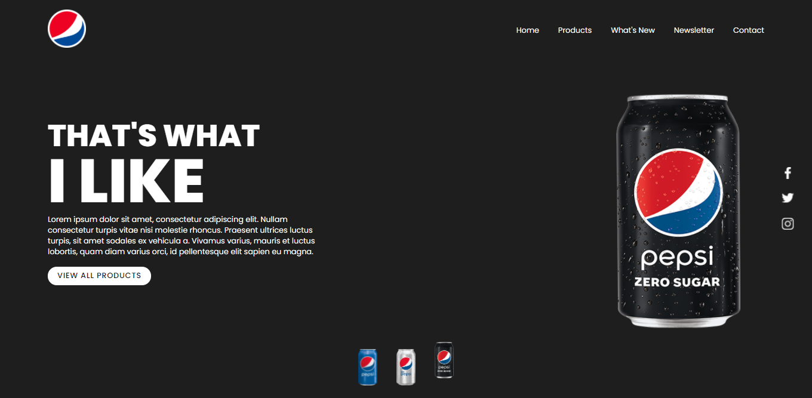

# Land Page Pepsi

## Description 📑
In this project, a responsive website for professional profile was developed.

* 📌 This project was done in a didactic way in order to improve my knowledge of the technologies used.
* 📌 The technologies used for the development of the project were, (HTML, CSS FLEX BOX, and JAVASCRIPT).
* 📌 This project is not hosted.

# Project Layout 🎨

## Color 1

## Color 2

## Color 3

